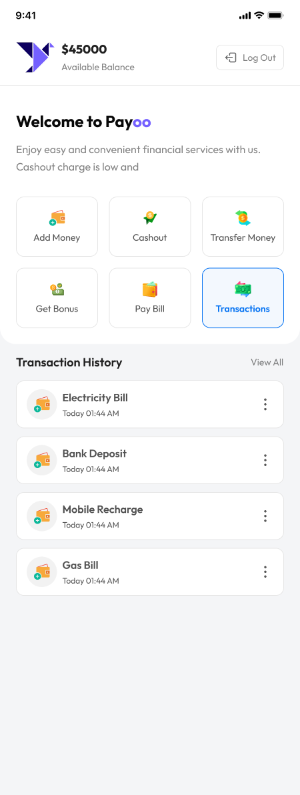

<h1 align="center">
 💰 PAYOO - Smart MFS Interface 
</h1>

## Overview
PAYOO is a smart Mobile Financial Services (MFS) interface that provides a seamless digital banking experience. Built with **HTML, CSS, DaisyUI and Vanilla JavaScript**, it offers a user-friendly platform for managing money transfers and financial transactions. The application supports key banking operations including adding money, cashouts, bonus rewards, and comprehensive transaction history tracking.

## 🔗 Live Link
👉 

## 🛠️ Technologies Used
- **Vanilla JavaScript(ES6+)**
- **HTML5**
- **CSS3**
- **Tailwind CSS**
- **DaisyUI**
- Responsive Web Design Principles
- DOM Manipulation & Event Handling

## ✨ Features 
- **Simple Login Interface** - Secure authentication with username and password
- **Home Dashboard** - View account balance and quick access to all services
- **Add Money** - Deposit funds into your PAYOO account
- **Cash Out** - Withdraw money with PIN verification
- **Money Transfer** - Send money to other users securely
- **Bonus Rewards** - Earn and track promotional bonuses
- **Transaction History** - Complete record of all financial activities
- **PIN Security System** - Every transaction requires PIN authentication for enhanced security
- **User-Friendly Interface** - Responsive design built with DaisyUI for optimal experience across devices

## ⚙️ Core Implementation Concepts
- Modular Scripting Architecture
- Dynamic State Management
- User Authentication & Access Control
- Interactive UI Component Handling
- Transaction Logging System
- Input Validation & Error Handling

## 🎯 Project Purpose
- Build a functional mobile banking interface mimicking digital wallets.
- Master code structuring by using independent, reusable JavaScript modules.
- Implement real-time updates for account balances and UI elements.
- Create a responsive, interactive dashboard with Tailwind and DaisyUI.
- Develop a complete system for input validation and automated logging.

## 👤 Author
**Md. Hadiuzzaman**

Textile Engineering Graduate | KUET | Focused on front-end architectures and building smart, responsive user applications.

## UI 
<table>
    <tr>
        <td>
        
        </td>
        <td >
        
        </td>
    </tr>
    <tr>
        <td>
        
        </td>
        <td >
        
        </td>
    </tr>
    <tr>
        <td>
        
        </td>
        <td >
        
        </td>
    </tr>
    <tr>
        <td>
        
        </td>
        <td >
        
        </td>
    </tr>
    
</table>

## 
